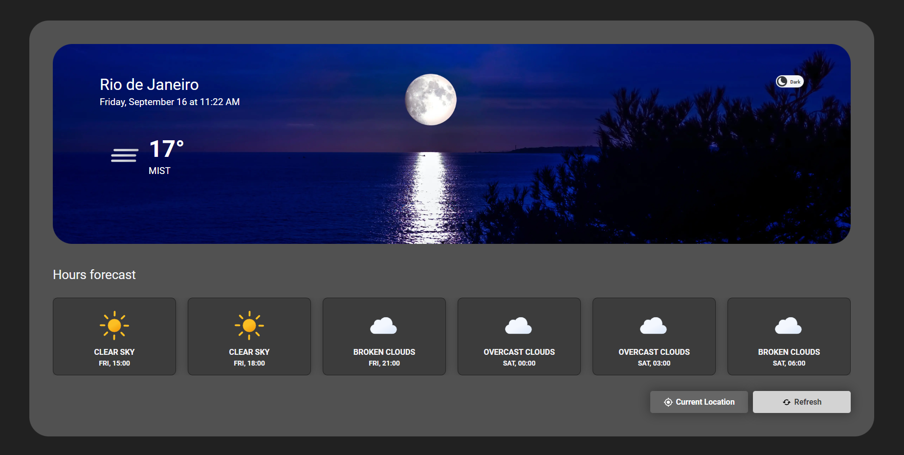

# Weather APP

> This application provides the user with the weather and weather forecast for their location, which the user has the option to provide or not. To get this data, I used the Weather API, where I pass the latitude and longitude and it returns the current, future and historical weather.

## 💻 Prerequisites

Before you begin, check that you have met the following requirements:
* You have installed the latest version of `<nodeJs>`
* You have a machine `<Windows / Linux / Mac>`.
* You read `<documentation>`.

## 💻 To run the project:

* Clone the project by running this command in the terminal `git clone <repo_url>`;
* First we have to:
  - Clone the project by running this command in the terminal `git clone <repo_url>`;
  - Register at site [Weather API site](https://home.openweathermap.org/users/sign_up) to get the api key, as it is needed to get the climate data;
    - After registering, just go to [this address](https://home.openweathermap.org/api_keys) and copy the key already created by default;
  - Open the project folder and duplicate the .env.example file and rename the copy to .env;
    - Then, in the variable `VITE_API_KEY` put the key copied from the site;
* Open the project folder in the terminal and run:
  - `yarn` or `npm install` -> To install all dependencies;
  - `yarn dev` or `npm run dev` -> To run the project;
* To run the tests just run `yarn test` or `npm run test`.

## Others images

--------------------------------------------------------

--------------------------------------------------------

